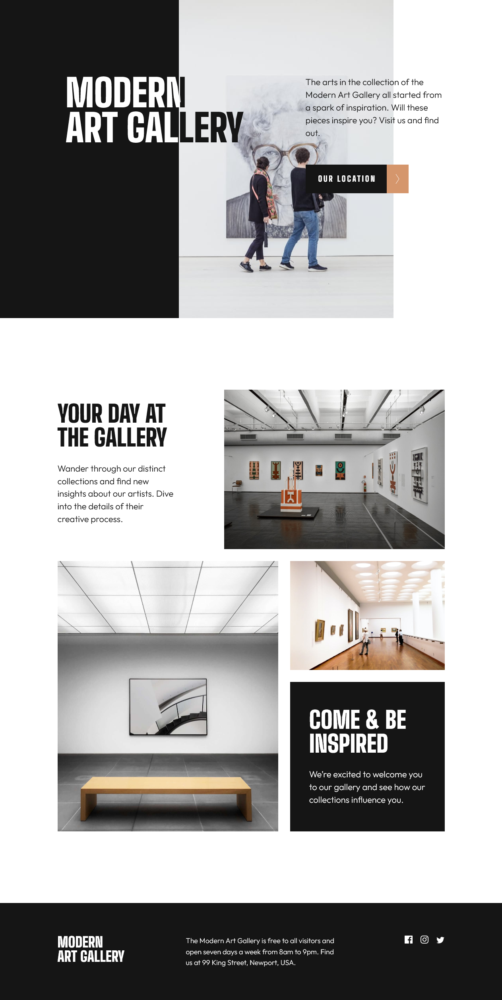
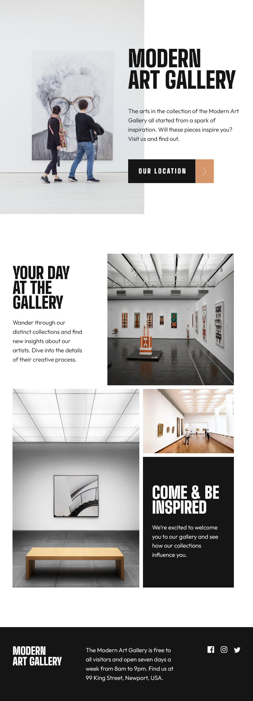
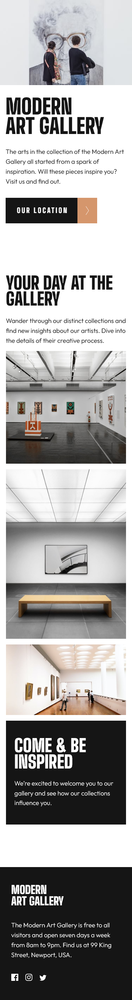

# Frontend Mentor - Art gallery website solution

This is a solution to the [Art gallery website challenge on Frontend Mentor](https://www.frontendmentor.io/challenges/art-gallery-website-yVdrZlxyA). Frontend Mentor challenges help you improve your coding skills by building realistic projects. 

## Table of contents

- [Overview](#overview)
  - [Screenshot](#screenshot)
  - [Links](#links)
- [What I learned](#what-i-learned)
  - [Built with](#built-with)
  - [Useful resources](#useful-resources)
- [Author](#author)

## Overview

### Screenshot

### Links

- Solution URL: (https://github.com/DeGuzman7/Art-Gallery-website)
- Live Site URL: (https://deguzman7.github.io/Art-Gallery-website/)

## What I learned

- learnt how to use the mix-blend-mode property

### Built with

- Semantic HTML5 markup
- CSS 
- Flexbox
- CSS Grid

### Useful resources

- [Example resource 1](https://codepen.io/aliencash/pen/MGoGXz?editors=1100) - This helped me with h1 header color.

## Author

- GitHub - [Chinedu](https://github.com/DeGuzman7)
- Frontend Mentor - [@DeGuzman7](https://www.frontendmentor.io/profile/DeGuzman7)

